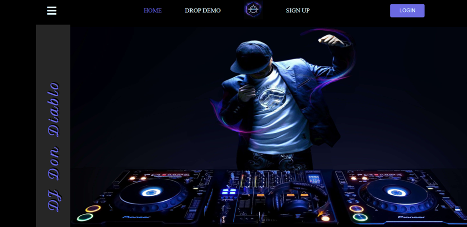
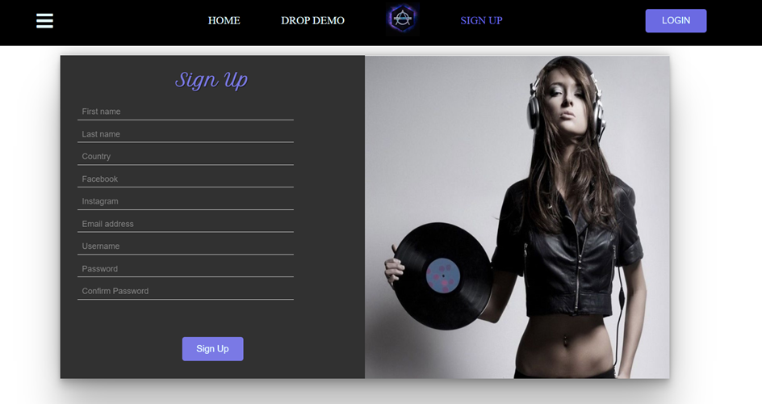
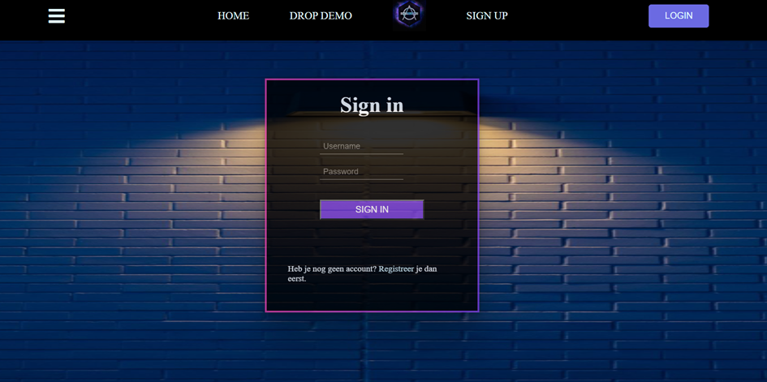
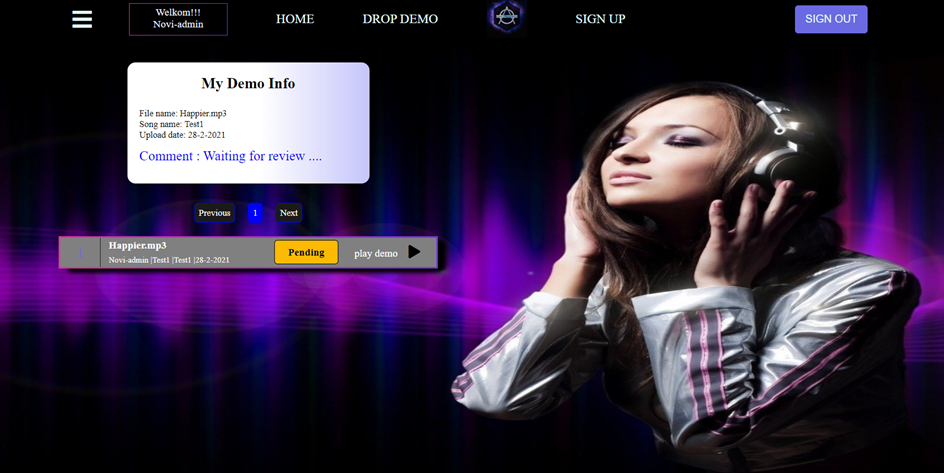
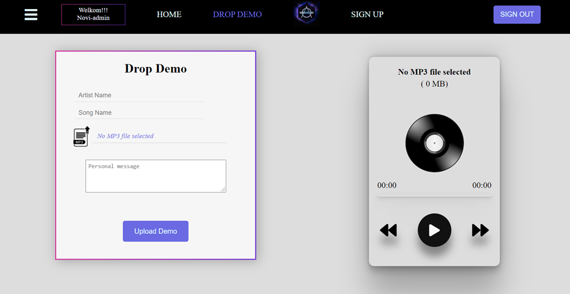
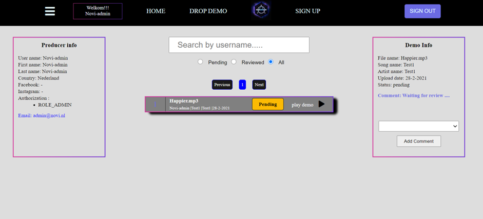
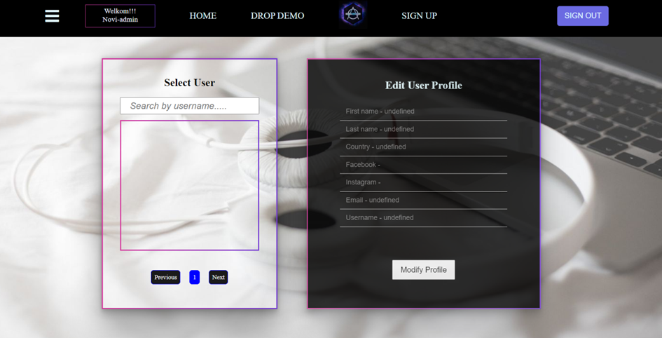

#“Promo Delivery System - DJ Don Diablo"

## De applicatie starten
Als je het project gecloned hebt naar jouw locale machine, installeer je eerst de node_modules
door het volgende commando in de terminal te runnen:

`npm install`

Wanneer dit klaar is, kun je de applicatie starten met behulp van:

`npm start`

of gebruik de WebStorm knop (npm start). Open [http://localhost:3000](http://localhost:3000) om
de pagina in de browser te bekijken.

Let op! Backend moet draaien anders kan je niet op alle pagina's

##Web Pagina's met commentaar

###1) Home Page

In Home pagina kan je bij opstarten zonder ingelogd te zijn enkel 2 links gebruiken namelijk Sign-up en Login.

###2) Sign-up Page

Hier kan een nieuwe gebruiker zich registreren d.m.v. van invullen van het form 

###3) Login Page

Na registratie kan de gebruiker zich inloggen d.m.v. opgegeven username en password. Standaard zijn er al 2 accounts standaard aangemaakt
USER account
Username: Novi-user
Password: Novi-user

ADMIN account
Username: Novi-admin
Password: Novi-admin

###4) My Demo Page

Standaard wordt je doorverwezen naar My Demo pagina en komt de naam van de ingelogde gebruiker te zien rechts boven in je navigatie balk. Hierin vind je eigen upgeload demo en eventueel meer informatie over je demo (b.v. comentaar) . Hier in kan je ook je demo afspelen.

###5) Drop Demo Page

In je Drop Demo pagina kan je MP3 bestand uploaden. En eventueel door je MP3 player beluisteren.

###6) Administrator Page

Deze pagina kan je enkel benaderen wanneer je een ROLE_ADMIN heb. Hierin heb je aan linker kant informatie van de Producer en aan je rechterkant informatie van je demo. In het Demo Info gedeelte kan je een commentaar toevoegen aan de geselecteerde demo. Midden vind je alle demo’s die zijn upgeload. Dit wordt door “Paginate” verdeeld in verschillende pagina’s per 5 demo’s.
Ook kan je selecteren welke demo’s een commentaar hebben of niet. In het zoekbalk is het ook mogelijk om demo’s te zoeken door middel van username.  Opmerking !!! momenteel werkt het verversen van het lijst na commentaar toevoegen nog niet. Wanneer je van pagina wisselt ververst het lijst 

###7) Edit Profile Page

Deze pagina is enkel te benaderen door ROLE_ADMIN. Hierin kan gezocht worden naar gebruikers doormiddel van username en eventueel aangepast worden. Er is ook mogelijk om een ROL aan te passen. 

###7) My Profile

My Profile is toegankelijk voor elke gebruiker en het gebruikers profiel wordt automatisch gekoppeld met de username waarmee je ingelogd bent. Hierin kan je enkel je eigen profiel aanpassen.

